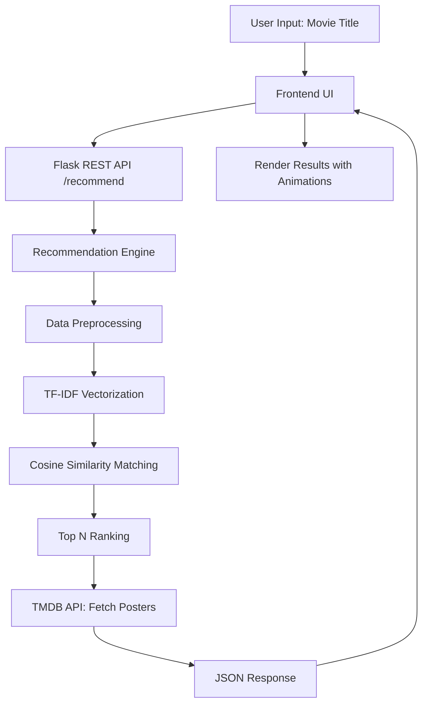

# 🎬 MovieMatch — AI-Powered Movie Recommendation System


A modern, high-performance AI-powered movie recommendation platform built using **Machine Learning**, **Flask**, and **Content-Based Filtering**. MovieMatch analyzes thousands of cinematic data points to surface the perfect film for you instantly.

---

## 🌟 Hero Overview

**MovieMatch** is designed to solve the "Paradox of Choice" in modern streaming. By leveraging Natural Language Processing (NLP) and mathematical similarity engines, it moves beyond simple genre tags to understand the thematic essence of cinema.

### How it Works
The system uses **Content-Based Filtering**, meaning it recommends movies similar to a specific film you already like. It doesn't rely on other users' ratings but instead "reads" the metadata of the movies themselves—including plot overviews, genres, keywords, cast, and directors—to find deep-rooted connections.

---

## ✨ Premium Features

- 🧠 **AI-Powered Recommendations:** Highly accurate matching using TF-IDF and Cosine Similarity.
- 🔍 **Real-Time Search Suggestions:** Intelligent autocomplete as you type.
- 🖼️ **TMDB Poster Integration:** Dynamic fetching of high-quality movie artwork via the TMDB API.
- 🎨 **Cinematic UI/UX:** A premium light-themed interface with glassmorphism and modern animations.
- 📱 **Fully Responsive:** Optimized for a seamless experience on Desktop, Tablet, and Mobile.
- ⚡ **Performance Optimized:** Precomputed similarity matrices for millisecond-latency responses.
- 📡 **RESTful Architecture:** Clean separation of frontend and backend via a robust Flask API.

---

## 🛠️ Tech Stack

| Layer | Technologies |
| :--- | :--- |
| **Frontend** | HTML5, Tailwind CSS, JavaScript (Vanilla ES6+) |
| **Backend** | Python 3.11+, Flask (REST API) |
| **AI/ML** | Scikit-learn, TF-IDF Vectorization, Cosine Similarity |
| **Data Processing** | Pandas, NumPy, python-dotenv |
| **Database/Source** | TMDB 5000 Movie Dataset |
| **API Integration** | TMDB API (v3) |

---

## 📐 System Architecture



---

## 🧠 How the AI Recommendation Engine Works

MovieMatch utilizes a **Content-Based Filtering** approach powered by Natural Language Processing.

### 1. Data Preprocessing & Feature Engineering
We extract features from the TMDB dataset, including `genres`, `keywords`, `overview`, `cast`, and `crew`. These disparate text fields are cleaned and concatenated into a single "Tag" or "Bag of Words" for each movie.

### 2. TF-IDF Vectorization
Computers cannot understand text; they understand numbers. We use **Term Frequency-Inverse Document Frequency (TF-IDF)** to convert text into a mathematical vector.
- **Term Frequency:** How often a word appears in a document.
- **Inverse Document Frequency:** Reduces the weight of common words (like "the", "a", "is") and increases the weight of unique, descriptive words (like "superhero", "space", "noir").

> **Formula Simplified:** $TF-IDF = TF(t, d) \times IDF(t)$

### 3. Cosine Similarity Calculation
Once movies are represented as vectors in a 15,000-dimensional space, we calculate the angle between them. 
- A **Cosine Similarity** of **1.0** means the movies are identical in content.
- A score of **0.0** means they have nothing in common.

> **Why Cosine?** It measures the orientation (similarity) of vectors regardless of their magnitude (text length).

---

## 📂 Project Structure

```bash
MovieMatch/
│
├── app.py                  # Flask web server, API routes, & TMDB integration
├── recommender.py          # Core ML Engine (The brain of the system)
├── tmdb_5000_movies.csv    # Dataset (Metadata for 5,000 films)
├── requirements.txt        # Production dependencies
├── .env                    # Environment variables (API Keys)
│
├── templates/
│   └── index.html          # Premium Tailwind CSS + JS Frontend
│
└── README.md               # Documentation
```

---

## 🚀 Installation & Setup

### 1. Clone the Repository
```bash
git clone https://github.com/vishnucax/MovieMatch.git
cd MovieMatch
```

### 2. Install Dependencies
```bash
pip install -r requirements.txt
```

### 3. Environment Configuration
Create a `.env` file in the root directory and add your TMDB API Key:
```env
TMDB_API_KEY=your_api_key_here
```

### 4. Run the Application
```bash
python app.py
```
Open your browser and navigate to `http://127.0.0.1:5000`.

---

## 📊 Dataset Detail
The project uses the **TMDB 5000 Movie Dataset**, a comprehensive collection of movie metadata.
- **Source:** Kaggle / TMDB API
- **Size:** 4,803 unique movies
- **Attributes:** Budget, genres, homepage, id, keywords, original_language, original_title, overview, popularity, production_companies, release_date, revenue, runtime, spoken_languages, status, tagline, title, vote_average, vote_count.

---

## 📡 API Documentation

### Get Recommendations
`POST /recommend`
- **Description:** Returns top 8 similar movies for a given title.
- **Request Body:** `{"title": "Inception"}`
- **Response:**
```json
{
  "query": "Inception",
  "recommendations": [
    {
      "title": "Interstellar",
      "similarity": 84.5,
      "year": "2014",
      "rating": 8.1,
      "genres": "Adventure, Drama, Science Fiction",
      "overview": "..."
    }
  ]
}
```

### Search Suggestions
`GET /search?q=inc`
- **Description:** Returns matching movie titles for autocomplete.
- **Response:** `["Inception", "Inception: The Beginning", ...]`

---

## 🎨 UI/UX Design

MovieMatch features a **Premium Cinematic Light Theme** designed with:
- **Glassmorphism:** Frosted glass effect on navigation and cards.
- **Modern Shadows:** Layered elevation for a 3D professional feel.
- **Micro-Interactions:** Smooth hover scales and transition effects.
- **Intelligent Loading:** Shimmer-effect skeleton screens during API calls.

---

## 📈 Performance & Optimization
- **Startup Computation:** The 5000x5000 similarity matrix is computed at startup and stored in memory, ensuring $O(1)$ lookup for similarity vectors during user requests.
- **Lazy Loading:** Posters are fetched asynchronously to ensure the UI remains responsive.

---

## 🔮 Future Roadmap
- [ ] **Collaborative Filtering:** Incorporate user-based ratings.
- [ ] **Transformer-based Embeddings:** Use BERT or GPT for deeper semantic understanding.
- [ ] **User Accounts:** Save watchlists and personalized history.
- [ ] **Platform Integration:** Direct links to watch on Netflix, Prime Video, or Disney+.

---

## 🎓 Learning Outcomes (Project Lifecycle)

| Learning Objective | Application in MovieMatch |
| :--- | :--- |
| **NLP Concepts** | Implementing TF-IDF for text representation. |
| **Vector Space Models** | Understanding Cosine Similarity for distance metrics. |
| **Data Engineering** | Cleaning complex JSON metadata using Pandas. |
| **Full-Stack Integration** | Connecting a Python ML model to a JS frontend. |
| **API Design** | Building a clean RESTful interface with Flask. |

---

## 📸 Screenshots

### Landing Page
*(Add Screenshot Here)*

### Search Results
*(Add Screenshot Here)*

---

## 📄 License
Distributed under the MIT License. See `LICENSE` for more information.

---

## 🤝 Contact

**Vishnu K**  
🚀 [Portfolio](https://vishnucax.github.io)  
🔗 [LinkedIn](https://www.linkedin.com/in/vishnu-k-7-)  
🐙 [GitHub](https://github.com/vishnucax)

---
*Project Created as part of the AI Engineering Portfolio Showcase.*
